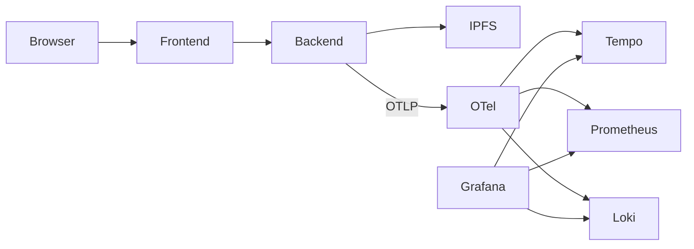

_This project has been created as part of the 42 curriculum by nponchon._

# ft_lgtm

Looks Good To Monitor (LGTM) is a Kubernetes-native observability platform built around a sandbox code editor. It demonstrates how metrics, traces and logs can be collected from a Go backend executing WebAssembly modules and visualised through the LGTM stack.

## Current Features

- Execute Go and JavaScript snippets in a WASM sandbox
- Resource-constrained execution using Wazero
- Publish successful executions to IPFS
- OpenTelemetry instrumentation (metrics, traces and logs)
- Prometheus metrics
- Tempo distributed tracing
- Loki structured logging
- Grafana dashboards
- Helm deployment
- ArgoCD GitOps deployment

## Description

This project is not only about deploying a traditional web application, but rather it focuses on how to build a distributed system that includes modern monitoring tools to help understand how the system works, and how to debug efficiently and quickly failed requests.

Here is a simple overview of the architecture:



#### Web Application

The web application consists of a simple client/server architecture:

- **client**: A very basic code editor that runs in a browser and allows the user to write code snippets and run them. The editor is powered by [CodeMirror](https://codemirror.net/docs/), a popular code editor library for the web. The rest is built with React and TypeScript. The client is served via a Nginx server.

- **server**: receives the code from the client and executes it in a WASM sandbox environment to prevent potential faulty programs (infinite loops, memory leaks) or malicious code (unauthorised file access, destructive programs). The server is built in Go for performance and architecture simplicity. It exposes data such as logs, metrics and traces that are sent to an OpenTelemetry service.

When receiving the code snippet from the client, the server compiles it into a Web Assembly module and executes it in a sandbox environment. The result of the execution is then sent back to the client.

The following diagram illustrates the architecture of the WASM environment:

```terminal
Kubernetes Pod

└── Linux Container

      └── Go Backend
      
             └── Wazero Runtime

                    └── User WASM Module
```

The WASM runtime lives directly inside the Go backend. The runtime is responsible for executing the user WASM module in a sandbox environment with the necessary security and resource constraints.

#### IPFS (Inter-Planetary File System)

When the run is successful, the source code and the corresponding output from stdout are published to the IPFS network and are publicly available. The core concept of IPFS is to share files via hashes instead of locations, which means that data is content-addressed rather than location-addressed like in the standard practice.

#### LGTM (LGTP)

The monitoring and observability stack consists of the following applications running alongside the app within the cluster, with each service having its own specific task:

- **OpenTelemetry Collector**: The Otel collector acts as a single source of data for the remaining services: Prometheus, for instance, could scrape directly the metrics exposed by the Backend via a dedicated Golang module, but this would require changing the source code of the server directly. With OpenTelemetry, the server is decoupled and has a single service to expose its data to, and if I were to change services in the future (use Jaeger instead of Tempo or Mimir instead of Prometheus), the server can remain as it is.

```terminal
               +----------------------+
               |   OTEL Collector     |
               |                      |
:4317 ◄────────┤ Receiver             |
               |                      |
               | Exporter ─────────► Tempo:4317
               | Exporter ─────────► Loki:3100
               | Exporter :8889 ◄──── scraped by Prometheus
               +----------------------+
```

- **Prometheus**: The metric collector. It gathers basic metrics such as the total number of Runs, failed and successful Runs, language used for each Run, etc.
- **Loki**: Loki stores structured application logs that are much more useful and detailed than a standard `log.Println()`. Combined with Tempo traces, it allows a request to be followed from metrics to traces down to the exact log entries generated during its execution.
- **Tempo**: Tempo handles the traces, which are an essential tool for debugging and for monitoring in general: When an HTTP request is received at `/api/run`, the HTTP handler triggers a Trace with a Span that will last for the duration of the request, ie. until it is complete (regardless of the success). This gives precious information such as the duration of each stage of the pipeline: compiling, executing, publishing. Very useful to detect spikes, latency or bottlenecks.
- **Grafana**: All this data is queried by Grafana which turns it into nice dashboards that are more readable for humans and make more sense:


## Instructions

A Makefile is at the root of the repo and offers multiple commands to guide on how to deploy this project:

```terminal
nicolas@pop-os:~/$ makenicolas@pop-os:~/Desktop/42/ft_lgtm (staging *)$ make
Usage: make [target]

Available targets:
  help            Show this help message
  all             Setup, build and deploy all services
  cluster         Install the k3d cluster
  build           Build the docker images and push them to the GHCR registry
  deploy          Deploy all services
  stop            Stop cluster
  start           Start the cluster
  clean           Delete cluster
  develop         Start the development environment
  develop-stop    Stop the development environment
```

## Resources

### References

[Kubernetes Documentation](https://kubernetes.io/docs/home)

[CodeMirror Documentation](https://codemirror.net/docs/)

[Wazero Documentation](https://pkg.go.dev/github.com/tetratelabs/wazero@v1.12.0)

[IPFS Documentation](https://docs.ipfs.tech/)

[IPFS Retrieval Check](https://check.ipfs.network/)

[Open Telemetry Documentation](https://opentelemetry.io/docs/)

[How to compile JavaScript to WebAssembly](https://vladvitan.medium.com/run-javascript-in-a-go-web-server-using-webassembly-0c4ba47f442d)

### AI Usage

For the development of this project, I used a combination of OpenAI's ChatGPT and Anthropic's Claude.

I used these tools for the following tasks:

- Generating the frontend: I used ChatGPT to generate the core structure of the frontend application, including the main components and routing. This project is about building a platform for monitoring and observability, not about building a frontend application, and I did not want to spend time fighting React components and npm compatibility issues.
- Writing boilerplate code: Copilot's autocomplete feature was used to help me generate boilerplate code, especially for the frontend services or the Helm charts. This reduced the amount of repetitive coding I had to do and the chances of introducing errors like typos or syntax mistakes.
- Discuss architecture and design decisions: I used ChatGPT and Claude to confront my ideas and discuss architecture and design decisions, especially the Go backend architecture and the WASM execution environment, as well as the Kubernetes cluster infrastructure.

I want to emphasise that in the course of this project, I checked any piece of code generated by AI tools to make sure I understood. I had to correct it many times because it contained errors or was simply not adapted to my project.

No agentic AI was used.
